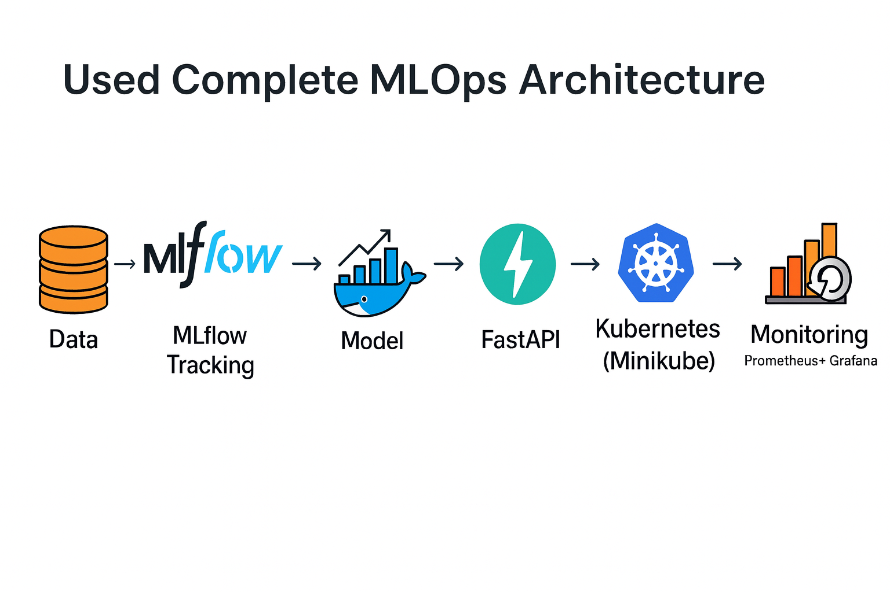
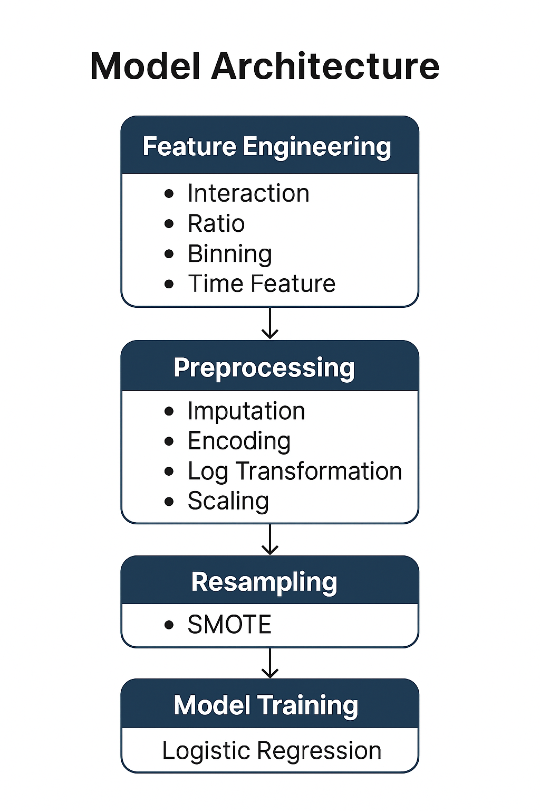

# **Fraud Detection MLOps Pipeline**

The **Fraud Detection MLOps Pipeline** is an end-to-end system designed to identify potentially fraudulent financial transactions with high accuracy and scalability. This project integrates **Machine Learning (ML) with MLOps principles** to ensure robust experimentation, deployment, and real-time monitoring of fraud detection models.


---

## **Table of Contents**

1. [Project Overview](#project-overview)
2. [Tech Stack](#tech-stack)
3. [Architecture Diagrams](#architecture-diagrams)
4. [Features](#features)
5. [Directory Structure](#directory-structure)
6. [Setup Instructions](#setup-instructions)
7. [Running the Streamlit App](#running-the-streamlit-app)
8. [Running the FastAPI Service](#running-the-fastapi-service)
9. [Experiment Tracking with MLflow](#experiment-tracking-with-mlflow)
10. [Monitoring with Prometheus & Grafana](#monitoring-with-prometheus--grafana)
11. [Model Details](#model-details)
12. [Results & Metrics](#results--metrics)
13. [Screenshots](#screenshots)
14. [Future Work](#future-work)
15. [Author / Contact](#author--contact)

## **1. Project Overview**

### **Objectives**

* This project implements a **complete MLOps pipeline** for **fraud detection** using transactional data. It covers the **entire ML lifecycle**
* Build a modular **FraudPipeline** capable of feature engineering, preprocessing, resampling (SMOTE), and threshold tuning.
* Track experiments using **MLflow** for reproducibility and comparative analysis.
* Deploy the model using **FastAPI** for REST API services and **Streamlit** for an interactive UI.
* Containerize and orchestrate services using **Docker** and **Kubernetes (Minikube)**.
* Monitor system health and metrics using **Prometheus** and **Grafana** dashboards.

### **Goal** 

Detect fraudulent transactions in real-time with **high recall** while minimizing false positives.

---

## **2. Tech Stack**

### **Languages**

* **Python 3.12+**

### **Core ML & Data Libraries**

* **Scikit-learn**: Model building, preprocessing, metrics.
* **Imbalanced-learn**: SMOTE for class imbalance handling.
* **Pandas / NumPy**: Data manipulation and numerical operations.

### **MLOps & Deployment Tools**

* **MLflow**: Experiment tracking, logging metrics, model registry.
* **FastAPI**: Serving the fraud detection model via REST API.
* **Streamlit**: Interactive web UI for predictions and model insights.
* **Docker**: Containerization of the FastAPI and Streamlit apps.
* **Kubernetes (Minikube)**: Local orchestration and scaling of microservices.

### **Monitoring Tools**

* **Prometheus**: Metrics scraping for FastAPI endpoints.
* **Grafana**: Visualization dashboards for system and API monitoring.

---

## **3. Architecture Diagrams**

### **MLOps Pipeline**

The complete pipeline involves:

1. **Data Ingestion & Preprocessing**
2. **Model Training & Threshold Optimization**
3. **Experiment Tracking with MLflow**
4. **Model Deployment via FastAPI & Streamlit**
5. **Containerization with Docker**
6. **Orchestration using Kubernetes (Minikube)**
7. **Monitoring using Prometheus + Grafana**



---

### **Model Pipeline**

1. **Feature Engineering**: Interaction, ratio, binning, time-of-day categorization.
2. **Preprocessing**: Imputation, encoding, log transform, scaling.
3. **Resampling**: SMOTE to address class imbalance.
4. **Model Training**: Logistic Regression (configurable to RandomForest/XGBoost).
5. **Threshold Tuning**: Optimize precision-recall trade-off for fraud detection.



---

## **4. Features**

* **Real-Time Fraud Prediction**:

  * Streamlit UI for quick predictions.
  * FastAPI endpoint for programmatic integration.

* **Experiment Tracking**:

  * MLflow logs parameters, metrics, artifacts (confusion matrix, PR curve).

* **Scalable Deployment**:

  * Dockerized microservices deployed on Kubernetes (Minikube).

* **Robust Monitoring**:

  * Prometheus scrapes real-time metrics from FastAPI.
  * Grafana dashboards visualize system health and request patterns.

* **Data Handling**:

  * Automatic preprocessing (missing values, scaling, encoding).
  * SMOTE resampling for highly imbalanced fraud datasets.

* **Threshold Optimization**:

  * Dynamically finds the best threshold balancing recall and precision.

## **5. Directory Structure**

The project follows a modular structure separating API, model, monitoring, and visualization components:

```
FRAUD_MLOPS_PROJECT/
│
├── API/                         # FastAPI microservice
│   ├── main.py                   # API entry point
│   ├── schemas.py                # Pydantic models for request/response
│   ├── services.py               # Core service logic
│   └── mlruns/                   # MLflow experiment tracking logs
│
├── Data/                         # Datasets
│   ├── payment_fraud.csv
│   └── combined_holdout.csv
│
├── Images/                       # Project diagrams & screenshots
│   ├── Docker/
│   ├── FastAPI/
│   ├── Grafana/
│   ├── MLFlow/
│   ├── MLOps_Architecture/
│   ├── Model_Architecture/
│   └── Prometheus/
│
├── K8s/                          # Kubernetes manifests
│   ├── fraud-api-deployment.yaml
│   ├── fraud-api-service.yaml
│   ├── grafana-deployment.yaml
│   └── prometheus-deployment.yaml
│
├── Notebooks/                    # Jupyter Notebooks
│   ├── EDA.ipynb
│   ├── training_model.ipynb
│   ├── test_files.ipynb
│   └── artifacts/                # Trained model artifacts
│       ├── confusion_matrix.png
│       ├── pr_curve.png
│       └── fraud_pipeline_deployed.pkl
│
├── Pages/                        # Streamlit multi-page app
│   ├── home.py
│   ├── about_model.py
│   ├── metrics_page.py
│   └── about_me.py
│
├── Src/                          # Core ML pipeline code
│   ├── model.py                   # FraudPipeline, FeatureEngineering, Preprocessing
│   ├── utils.py                   # Helper functions
│   ├── config.py                  # Configurations
│   └── artifacts/                 # MLflow model logs
│
├── app.py                         # Streamlit entry point
├── Dockerfile                      # Docker setup for Streamlit/FastAPI
├── requirements.txt                # Dependencies
├── .gitignore
└── README.md
```

---

## **6. Setup Instructions**

### **Prerequisites**

* Python 3.10 or higher
* Docker Desktop
* Minikube (for Kubernetes)
* kubectl CLI
* Prometheus & Grafana (installed via Helm or K8s manifests)

---

### **Local Development Setup**

1. **Clone the repository**

```bash
git clone https://github.com/<your-username>/fraud-mlops.git
cd fraud-mlops
```

2. **Create virtual environment & install dependencies**

```bash
python -m venv .venv
source .venv/bin/activate    # Linux/Mac
.venv\Scripts\activate       # Windows
pip install -r requirements.txt
```

3. **Run Streamlit app locally**

```bash
streamlit run app.py
```

4. **Run FastAPI service locally**

```bash
cd API
uvicorn main:app --reload --host 0.0.0.0 --port 8000
```

---

### **Docker Setup**

1. **Build Docker images**

```bash
docker build -t fraud-streamlit -f Dockerfile .
docker build -t fraud-fastapi -f Dockerfile ./API
```

2. **Run containers**

```bash
docker run -p 8501:8501 fraud-streamlit
docker run -p 8000:8000 fraud-fastapi
```

---

### **Kubernetes Deployment (Minikube)**

1. **Start Minikube**

```bash
minikube start --driver=docker
```

2. **Apply Kubernetes manifests**

```bash
kubectl apply -f K8s/fraud-api-deployment.yaml
kubectl apply -f K8s/fraud-api-service.yaml
kubectl apply -f K8s/prometheus-deployment.yaml
kubectl apply -f K8s/grafana-deployment.yaml
```

3. **Access services**

```bash
minikube service fraud-api-service
minikube service prometheus -n monitoring
minikube service grafana -n monitoring
```

## **7. Running the Streamlit App**

The Streamlit app provides an interactive interface to test fraud detection predictions and visualize model metrics.

### **Local Run**

```bash
streamlit run app.py
```

* Access at: `http://localhost:8501`

### **Features**

* Input transaction details (Category, Payment Method, Account Age, etc.)
* Auto-fill examples for **Legitimate** and **Fraudulent** transactions
* Real-time prediction with threshold-based confidence
* Navigation to **About Model**, **Metrics**, and **About Me** pages

---

## **8. Running the FastAPI Service**

FastAPI serves the fraud prediction model as a REST API, useful for production-grade deployment and integration with external systems.

### **Local Run**

```bash
cd API
uvicorn main:app --reload --host 0.0.0.0 --port 8000
```

* Access API docs at: `http://localhost:8000/docs`

### **Key Endpoints**

* `POST /predict` – Accepts JSON payload and returns prediction
* `GET /health` – Health check endpoint

### **Docker Run**

```bash
docker build -t fraud-fastapi -f Dockerfile ./API
docker run -p 8000:8000 fraud-fastapi
```

---

## **9. Experiment Tracking with MLflow**

MLflow is integrated to log experiments, parameters, metrics, and artifacts (PR curve, confusion matrix, models).

### **Usage**

* Automatically tracks during training via `FraudPipeline`
* Logs include:

  * Parameters: Steps applied, resampling method, model type
  * Metrics: Accuracy, Precision, Recall, F1-score, PR-AUC
  * Artifacts: PR Curve, Confusion Matrix, Serialized Model

### **Access MLflow UI**

```bash
mlflow ui
```

* Opens at `http://127.0.0.1:5000`
* Explore experiment runs and compare metrics visually

---

## **10. Monitoring with Prometheus & Grafana**

The deployed FastAPI service exposes metrics for Prometheus, visualized via Grafana dashboards.

### **Prometheus**

* Scrapes FastAPI metrics (request counts, response latency, error rates)
* Runs on port **9090** in `monitoring` namespace

### **Grafana**

* Visualizes Prometheus data using pre-built dashboards
* Runs on port **3000** in `monitoring` namespace
* Import your **saved JSON dashboard** via Grafana UI

### **Steps to Access**

```bash
minikube service prometheus -n monitoring
minikube service grafana -n monitoring
```

Here are **Points 11 to 15** for your README:

---

## **11. Model Details**

The fraud detection model is built using a **custom pipeline** with multiple stages:

### **Pipeline Steps**

1. **Feature Engineering**

   * Interaction: `Category x PaymentMethod`
   * Ratio: `paymentMethodAgeDays / accountAgeDays`
   * Binning: `accountAgeDays` into `new/medium/old`
   * Time Feature: Categorize `localTime` into time-of-day bins

2. **Preprocessing**

   * Imputation for missing values (median/mode)
   * One-hot encoding for categorical variables
   * Log transformation for skewed features
   * Scaling: StandardScaler (skewed) + MinMaxScaler (symmetric)

3. **Resampling**

   * **SMOTE** to handle extreme class imbalance

4. **Model Training**

   * Logistic Regression (default)
   * Supports other models like RandomForest, XGBoost

5. **Threshold Tuning**

   * Optimal threshold found via precision-recall curve
   * Current best threshold: **0.8370** (Precision = 0.955, Recall = 0.991)

---

## **12. Results & Metrics**

### **Hold-out Set Performance**

* **Hold-out A**: Accuracy 97%, Recall 100%, Precision 25% (imbalanced case)
* **Hold-out B**: Accuracy 99%, Recall 100%, Precision 50% (imbalanced case)
* **Hold-out C**: Accuracy 98%, Recall 98%, Precision 98%

### **PR Curve & Confusion Matrix**

* Stored in `Notebooks/artifacts/`
* PR Curve demonstrates strong precision-recall balance
* Confusion Matrix confirms minimal false negatives (critical for fraud detection)

---

## **13. Screenshots**

Screenshots for architecture and UI are included in the `Images/` folder:

* **MLOps Architecture** (`Images/MLOps_Architecture/`)
* **Model Architecture** (`Images/Model_Architecture/`)
* **Grafana & Prometheus Dashboards** (`Images/Grafana/`, `Images/Prometheus/`)
* **Streamlit UI** (Home, Metrics, About Model)

Embed examples in README:

```markdown

```

---

## **14. Future Work**

* Integrate **CI/CD pipelines** with GitHub Actions or Jenkins
* Add **model registry** using MLflow’s registry or Seldon Core
* Deploy **cloud-native** on AWS/GCP/Azure (EKS/GKE/AKS)
* Implement **real-time streaming predictions** with Kafka
* Add **explainability (SHAP/LIME)** for fraud predictions

---

## **15. Author / Contact**

**Author:** Mohit Gupta

* [GitHub](https://github.com/)
* [LinkedIn](https://www.linkedin.com/)

Feel free to connect for feedback, contributions, or collaborations.